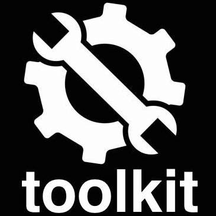

# toolkit 

  [](https://github.com/guang-yu-zhu/toolkit)
  [](https://opensource.org/licenses/MIT/)
  [](https://lifecycle.r-lib.org/articles/stages.html#stable)
[](https://CRAN.R-project.org/package=toolkit)
[](https://github.com/guang-yu-zhu/toolkit/actions/workflows/release.yml)

## Installation

```R
devtools::install_github('guang-yu-zhu/toolkit')
```


